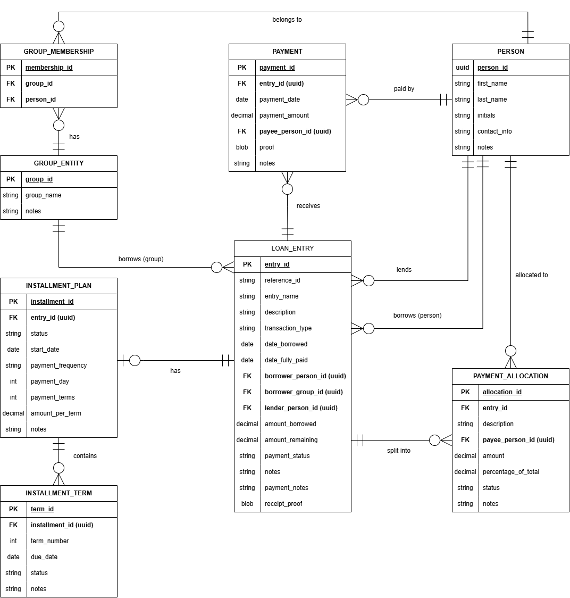

# Loan Tracking System
## Entity Relationship Diagram (ERD) Technical Documentation

<div align="center">
  
</div>

---

## 1. Overview

The Entity Relationship Diagram (ERD) for the Loan Tracking System models all data entities required to support the full CRUD lifecycle of loan entries, payments, installment plans, group expenses, and contact management.

The system revolves around a central entity — `LOAN_ENTRY` — from which all other entities either extend or associate. The design strictly enforces the system's core constraint: an installment transaction type cannot simultaneously have a group borrower.

### 1.1 Design Principles
* **Distributed Keys:** All primary keys are UUIDs auto-generated at the application layer, ensuring uniqueness across distributed environments without sequential leakage.
* **Referential Integrity:** Foreign keys enforce strict referential integrity at the database level through PostgreSQL constraints.
* **Exclusive-Or Association:** Nullable foreign keys (`borrower_person_id` and `borrower_group_id` on `LOAN_ENTRY`) are used to represent the exclusive-or constraint between individual and group borrowers, enforced explicitly at the service layer.
* **Cached Performance State:** Derived fields such as `amount_remaining` and `payment_status` are stored directly in the database to avoid expensive recalculation on every query. These are synchronized via the service layer on every payment event.
* **Flat Domain Validation:** Enumerated values (`transaction_type`, `payment_status`, `installment_status`) are stored as strings with SQL `CHECK` constraints rather than separate lookup tables, reducing join complexity for a single-user system.

---

## 2. Entity Descriptions

### 2.1 PERSON
Represents an individual contact in the system — either a borrower, a lender, a group member, or a payee on a payment record. Since the system assumes a single user, the user themselves is also represented as a `PERSON` record and referenced wherever they appear as a borrower or lender.

| Attribute | Data Type | Constraint | Notes |
| :--- | :--- | :--- | :--- |
| `person_id` | UUID | PK, NOT NULL | Auto-generated primary key |
| `first_name` | VARCHAR | NOT NULL | Given name of the contact |
| `last_name` | VARCHAR | NOT NULL | Family name of the contact |
| `initials` | VARCHAR | NOT NULL | Used to generate Reference IDs (e.g., DJP) |
| `contact_info` | VARCHAR | NULLABLE | Phone, email, or other contact detail |
| `notes` | TEXT | NULLABLE | Free-form notes about the person |

### 2.2 GROUP_ENTITY
Represents a named collection of people for group expense entries. The entity is named `GROUP_ENTITY` in the database to avoid conflict with the reserved SQL keyword `GROUP`. Each group has a short abbreviation used in Reference ID generation when a group is the borrower.

| Attribute | Data Type | Constraint | Notes |
| :--- | :--- | :--- | :--- |
| `group_id` | UUID | PK, NOT NULL | Auto-generated primary key |
| `group_name` | VARCHAR | NOT NULL | Display name of the group |
| `group_abbreviation` | VARCHAR | NOT NULL | Short code used in Reference ID generation |
| `notes` | TEXT | NULLABLE | Free-form notes about the group |

### 2.3 GROUP_MEMBERSHIP
An associative (junction) entity that resolves the many-to-many relationship between `PERSON` and `GROUP_ENTITY`. A person may belong to multiple groups, and a group contains multiple persons. This entity holds no additional attributes beyond its composite foreign keys and its own surrogate key.

| Attribute | Data Type | Constraint | Notes |
| :--- | :--- | :--- | :--- |
| `membership_id` | UUID | PK, NOT NULL | Auto-generated surrogate key |
| `group_id` | UUID | FK → `GROUP_ENTITY`, NOT NULL | The group this membership belongs to |
| `person_id` | UUID | FK → `PERSON`, NOT NULL | The person who is a member |

### 2.4 LOAN_ENTRY
The central entity of the system. Every financial transaction — whether a straight loan, installment plan, or group expense — is recorded as a `LOAN_ENTRY` row. The `transaction_type` column drives the operational behavior of the entire system: it determines which related entities are created, which UI panels are shown, and how payment statuses are computed.

| Attribute | Data Type | Constraint | Notes |
| :--- | :--- | :--- | :--- |
| `entry_id` | UUID | PK, NOT NULL | Auto-generated primary key |
| `reference_id` | VARCHAR | NOT NULL | Generated: borrower initials + lender initials |
| `entry_name` | VARCHAR | NOT NULL | User-defined label for the entry |
| `description` | TEXT | NULLABLE | Optional description of the loan |
| `transaction_type`| VARCHAR | NOT NULL, CHECK | `STRAIGHT_EXPENSE` \| `INSTALLMENT_EXPENSE` \| `GROUP_EXPENSE` |
| `date_borrowed` | DATE | NULLABLE | Date the money was lent or borrowed |
| `date_fully_paid` | DATE | NULLABLE | Date the loan was fully settled |
| `borrower_person_id`| UUID | FK → `PERSON`, NULLABLE | Set when borrower is an individual |
| `borrower_group_id` | UUID | FK → `GROUP_ENTITY`, NULLABLE| Set when borrower is a group |
| `lender_person_id` | UUID | FK → `PERSON`, NOT NULL | The person who lent the money |
| `amount_borrowed` | DECIMAL(15,2)| NOT NULL | Original loan amount |
| `amount_remaining`| DECIMAL(15,2)| NOT NULL | Remaining balance; defaults to `amount_borrowed` |
| `payment_status` | VARCHAR | NOT NULL, CHECK | `UNPAID` \| `PARTIALLY_PAID` \| `PAID`; defaults to `UNPAID`|
| `notes` | TEXT | NULLABLE | General notes on the loan |
| `payment_notes` | TEXT | NULLABLE | Notes specific to payment history |
| `receipt_proof` | BYTEA | NULLABLE | Binary blob for receipt or proof of loan photo |

### 2.5 PAYMENT
Records each individual payment event made against a `LOAN_ENTRY`. Every time a borrower makes a full or partial payment, a `PAYMENT` row is inserted and the parent entry's `amount_remaining` and `payment_status` are updated accordingly. If the loan was made by a group, the payee field identifies which specific group member is making the payment.

| Attribute | Data Type | Constraint | Notes |
| :--- | :--- | :--- | :--- |
| `payment_id` | UUID | PK, NOT NULL | Auto-generated primary key |
| `entry_id` | UUID | FK → `LOAN_ENTRY`, NOT NULL| The loan entry this payment belongs to |
| `payment_date` | DATE | NOT NULL | Date the payment was made; defaults to current date|
| `payment_amount` | DECIMAL(15,2)| NOT NULL | Amount paid in this transaction |
| `payee_person_id` | UUID | FK → `PERSON`, NOT NULL | Person who made the payment |
| `proof` | BYTEA | NULLABLE | Binary blob for payment proof (e.g., GCash screenshot)|
| `notes` | TEXT | NULLABLE | Optional notes on this payment |

### 2.6 INSTALLMENT_PLAN
A dependent entity that only exists when the parent `LOAN_ENTRY` has a `transaction_type` of `INSTALLMENT_EXPENSE`. It defines the schedule for repayment: when it starts, how frequently payments are due, how many terms there are, and how much is due per term. It maintains a strict one-to-one relationship with `LOAN_ENTRY`.

| Attribute | Data Type | Constraint | Notes |
| :--- | :--- | :--- | :--- |
| `installment_id` | UUID | PK, NOT NULL | Auto-generated primary key |
| `entry_id` | UUID | FK → `LOAN_ENTRY`, NOT NULL, UNIQUE | The parent loan entry (1-to-1) |
| `status` | VARCHAR | NOT NULL, CHECK | `NOT_STARTED` \| `UNPAID` \| `PAID` \| `SKIPPED` \| `DELINQUENT` |
| `start_date` | DATE | NOT NULL | Date when the first term becomes due |
| `payment_frequency`| VARCHAR | NOT NULL, CHECK | `MONTHLY` \| `WEEKLY` |
| `payment_day` | INTEGER | NOT NULL | Day of month (1-28) or day of week (0=Sun, 6=Sat) |
| `payment_terms` | INTEGER | NOT NULL | Total number of installment terms |
| `amount_per_term` | DECIMAL(15,2)| NOT NULL | Fixed amount due each term |
| `notes` | TEXT | NULLABLE | Optional notes on the installment plan |

### 2.7 INSTALLMENT_TERM
A weak entity dependent on `INSTALLMENT_PLAN`. Each row represents one structural term (e.g., Month 1, Month 2) in the installment schedule. The status of each term is computed dynamically by the service layer based on the system date, start date, and payment frequency. Terms are generated eagerly when the plan is finalized and updated as payments are applied.

| Attribute | Data Type | Constraint | Notes |
| :--- | :--- | :--- | :--- |
| `term_id` | UUID | PK, NOT NULL | Auto-generated surrogate key |
| `installment_id` | UUID | FK → `INSTALLMENT_PLAN`, NOT NULL | The parent installment plan |
| `term_number` | INTEGER | NOT NULL | Sequential position index (1, 2, 3...) |
| `due_date` | DATE | NOT NULL | Computed due date for this term |
| `status` | VARCHAR | NOT NULL, CHECK | `NOT_STARTED` \| `UNPAID` \| `PAID` \| `SKIPPED` \| `DELINQUENT` |
| `notes` | TEXT | NULLABLE | Optional notes on this specific term |

### 2.8 PAYMENT_ALLOCATION
An optional dependent entity that only exists when the parent `LOAN_ENTRY` has a `transaction_type` of `GROUP_EXPENSE`. Each row defines one person's share of the group expense — either as a fixed amount, a percentage of the total, or an equal split. The system supports three split methodologies: Divide Equally, Divide by Percent, and Divide by Amount.

| Attribute | Data Type | Constraint | Notes |
| :--- | :--- | :--- | :--- |
| `allocation_id` | UUID | PK, NOT NULL | Auto-generated primary key |
| `entry_id` | UUID | FK → `LOAN_ENTRY`, NOT NULL| The parent group expense entry |
| `description` | VARCHAR | NOT NULL | Label for this allocation item (e.g., dish name) |
| `payee_person_id` | UUID | FK → `PERSON`, NOT NULL | The group member responsible for this share |
| `amount` | DECIMAL(15,2)| NOT NULL | Amount this person owes |
| `percentage_of_total`| DECIMAL(5,2)| NOT NULL | This person's share as a percentage (0-100) |
| `status` | VARCHAR | NOT NULL, CHECK | `UNPAID` \| `PARTIALLY_PAID` \| `PAID` |
| `notes` | TEXT | NULLABLE | Optional notes on this allocation |

---

## 3. Relationships & Cardinality

The following table documents all relationships in the ERD using crow's foot notation conventions from Hoffer, Ramesh & Topi. Cardinality is expressed as minimum..maximum pairs on both sides of each relationship.

| Entity A | Cardinality | Entity B | Description |
| :--- | :--- | :--- | :--- |
| `PERSON` | 1..1 to 0..* | `GROUP_MEMBERSHIP` | A person may belong to zero or many groups. Each membership record belongs to exactly one person. |
| `GROUP_ENTITY` | 1..1 to 1..* | `GROUP_MEMBERSHIP` | A group must have at least one member. Each membership belongs to exactly one group. |
| `PERSON` | 1..1 to 0..* | `LOAN_ENTRY` (borrower) | A person may be the borrower on zero or many entries. Each entry has at most one individual borrower. |
| `GROUP_ENTITY` | 1..1 to 0..* | `LOAN_ENTRY` (borrower) | A group may be the borrower on zero or many entries. Each entry has at most one group borrower. |
| `PERSON` | 1..1 to 0..* | `LOAN_ENTRY` (lender) | A person may be the lender on zero or many entries. Each entry has exactly one distinct lender. |
| `LOAN_ENTRY` | 1..1 to 0..* | `PAYMENT` | A loan entry may have zero or many payments recorded against it. Each payment maps to exactly one entry. |
| `PERSON` | 1..1 to 0..* | `PAYMENT` | A person may appear as the payee on zero or many payments. Each payment has exactly one payee. |
| `LOAN_ENTRY` | 1..1 to 0..1 | `INSTALLMENT_PLAN` | A loan entry of type `INSTALLMENT_EXPENSE` has exactly one installment plan. Straight and group expense entries have none. |
| `INSTALLMENT_PLAN` | 1..1 to 1..* | `INSTALLMENT_TERM` | An installment plan must have at least one term. Each term belongs to exactly one plan. |
| `LOAN_ENTRY` | 1..1 to 0..* | `PAYMENT_ALLOCATION`| A group expense entry has one or more allocation rows. Straight and installment entries have none. |
| `PERSON` | 1..1 to 0..* | `PAYMENT_ALLOCATION`| A person may appear in zero or many allocation rows. Each allocation row targets exactly one person. |

---

## 4. Business Rules Reflected in the ERD

### 4.1 Exclusive-or Borrower Constraint
`LOAN_ENTRY` contains two nullable foreign keys for the borrower: `borrower_person_id` and `borrower_group_id`. Exactly one must be non-null. This implements the exclusive-or constraint described in the requirements: a loan is either with an individual or a group, never both. This is enforced via an SQL `CHECK` constraint:

```sql
ALTER TABLE LOAN_ENTRY ADD CONSTRAINT chk_exclusive_borrower 
CHECK (
    (borrower_person_id IS NOT NULL AND borrower_group_id IS NULL) OR 
    (borrower_person_id IS NULL AND borrower_group_id IS NOT NULL)
);

## 4.2 Installment Cannot Be a Group Expense

Per the system's assumptions and limitations, a `LOAN_ENTRY` cannot simultaneously:

- have `transaction_type = INSTALLMENT_EXPENSE`
- AND have a group borrower (`borrower_group_id`)

This constraint is enforced at the service layer.

The following entities are therefore mutually exclusive:

- `INSTALLMENT_PLAN`
- `PAYMENT_ALLOCATION`

Both entities being populated for the same loan entry is considered an invalid state.

---

## 4.3 Derived and Computed Fields

Several attributes are technically derivable but are stored explicitly for performance optimization.

### Stored Derived Fields

- `amount_remaining` on `LOAN_ENTRY`
  - Derived from:
    - `amount_borrowed`
    - minus the sum of related `PAYMENT.payment_amount`
  - Stored to avoid recalculating balances on every query.

- `payment_status` on `LOAN_ENTRY`
  - Derived from `amount_remaining`
  - Rules:
    - `UNPAID` → remaining balance equals original amount
    - `PAID` → remaining balance is zero
    - `PARTIALLY_PAID` → remaining balance is between zero and original amount

- `status` on `INSTALLMENT_TERM`
  - Derived from:
    - current system date
    - term due date
    - payment history

---

## 4.4 Reference ID Generation

The `reference_id` attribute on `LOAN_ENTRY` is a generated alphanumeric identifier.

It is computed using borrower and lender initials.

### Generation Rules

#### Individual Borrower

Format:

```text
[borrower initials]-[lender initials]
```

Example:

```text
DJP-MAR
```

#### Group Borrower

Format:

```text
[group abbreviation]-[lender initials]
```

Example:

```text
FAM-DJP
```

### Supporting Attributes

The following attributes exist specifically to support this generation logic:

- `PERSON.initials`
- `GROUP_ENTITY.group_abbreviation`

---

## 4.5 Auto-complete Logic

The system supports auto-completing loan entries.

When an entry is auto-completed:

- `payment_status` is updated to `PAID`
- `amount_remaining` is set to `0.00`
- `date_fully_paid` is assigned the current system date

This operation is implemented at the service layer and does not require additional ERD entities.

---

# 5. Normalization

The schema follows **Third Normal Form (3NF)** according to Hoffer, Ramesh & Topi.

---

## 5.1 First Normal Form (1NF)

The schema satisfies 1NF because:

- all attributes contain atomic values
- no repeating groups exist
- no multi-valued columns are used

### Notes

- Binary proof fields (`BYTEA`) are treated as atomic values.
- If multiple attachments are required in future versions, a separate attachment entity should be introduced.

---

## 5.2 Second Normal Form (2NF)

The schema satisfies 2NF because:

- associative entities remove partial dependencies
- repeating structures are normalized into separate entities

### Examples

- `GROUP_MEMBERSHIP`
  - resolves the many-to-many relationship between:
    - `PERSON`
    - `GROUP_ENTITY`

- `INSTALLMENT_TERM`
  - prevents storing installment schedules as repeating columns or comma-separated values

---

## 5.3 Third Normal Form (3NF)

The schema satisfies 3NF because:

- no transitive dependencies exist
- all non-key attributes depend only on their entity's primary key

### Notes

The following attributes are stored computed values:

- `LOAN_ENTRY.payment_status`
- `LOAN_ENTRY.amount_remaining`

These are cached derived values for performance purposes and do not violate 3NF.

---

# 6. Enumerated Values Reference

| Column | Entity | Valid Values |
|---|---|---|
| `transaction_type` | `LOAN_ENTRY` | `STRAIGHT_EXPENSE`, `INSTALLMENT_EXPENSE`, `GROUP_EXPENSE` |
| `payment_status` | `LOAN_ENTRY` | `UNPAID`, `PARTIALLY_PAID`, `PAID` |
| `status` | `INSTALLMENT_PLAN` | `NOT_STARTED`, `UNPAID`, `PAID`, `SKIPPED`, `DELINQUENT` |
| `status` | `INSTALLMENT_TERM` | `NOT_STARTED`, `UNPAID`, `PAID`, `SKIPPED`, `DELINQUENT` |
| `status` | `PAYMENT_ALLOCATION` | `UNPAID`, `PARTIALLY_PAID`, `PAID` |
| `payment_frequency` | `INSTALLMENT_PLAN` | `MONTHLY`, `WEEKLY` |

---

# 7. Assumptions & Limitations

- The system assumes a single-user environment.
- No `USER` or `SESSION` entity exists in the ERD.
- The logged-in user is represented as a `PERSON` record.

### Additional Assumptions

- Installment expenses cannot use group borrowers.
- Binary proof files are stored inline using `BYTEA`.
- `payment_day` interpretation depends on `payment_frequency`:
  - `MONTHLY` → values `1–28`
  - `WEEKLY` → values `0–6` (`0 = Sunday`)
- `reference_id` values are human-readable identifiers and are not guaranteed to be globally unique.

---